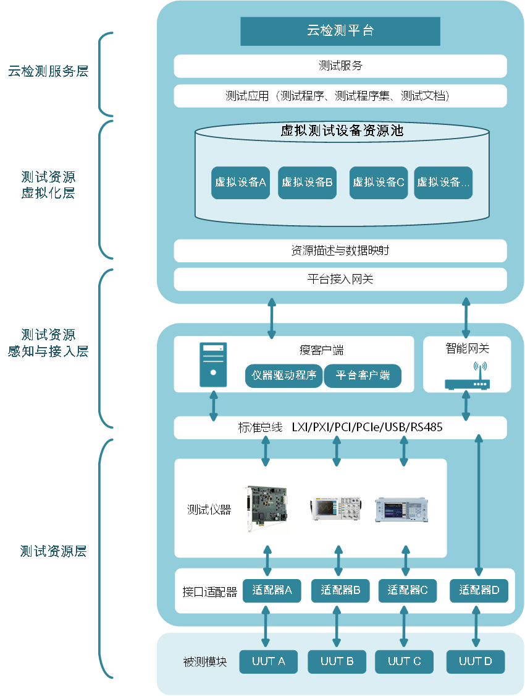
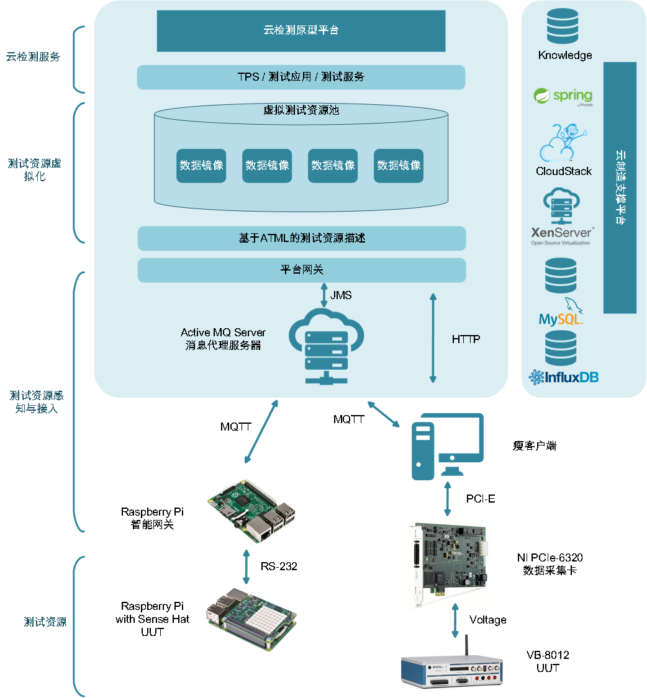

# 系统架构

基于云制造理论体系，提出针对电子组装制造业模块及整机测试环节的云检测模式架构，原型系统是对此架构的具体实现，本文档对该部分进行介绍。

## 云检测模式架构

基于云制造理论体系的云检测模式架构如下图所示：

面向电子组装制造行业模块与整机测试环节的云检测架构共分为四层，分别是测试资源层、测试资源感知与接入层、测试资源虚拟化层，以及云检测服务层。 
测试资源层包括传统自动测试系统中的各种模块，包括被测模块、接口适配器，以及各种测试仪器、专用仪表。由于该部分的设备已经高度成熟、模块化、标准化，考虑到实现成本，云检测平台需要在充分考虑前向兼容性的前提下将其接入。 
测试资源感知与接入层位于云检测平台的底端，是平台测试设备接入云平台的基础。该层要充分考虑测试设备与生产加工设备的异同点，测试设备作为一种数据驱动型的设备，在使用过程中会产生大量的、多种多样的各类数据，同时，大部分环节对数据传输的实时性要求较高。因此测试资源的感知与接入不能硬套现有云制造平台中的接入技术，而是要做出适应性的改进。针对不同的测试设备，感知接入层的设备网关要有兼容各个专用设备的驱动程序，同时，将不同型号设备使用的各种通用或私有的协议数据转换包装为平台中的通用协议。 
测试资源虚拟化层对测试资源感知层接入的测试设备进行描述，在平台中形成虚拟化测试设备，这些测试设备形成巨大的虚拟测试资源池。测试资源的虚拟化与云制造中的资源虚拟化也有所不同，云制造中的硬件虚拟化的研究当前都是针对生产加工设备的，强调对资源的描述，目的是实现制造硬资源统一的管理与调度，而测试装备与制造装备的不同：产出数据，数据驱动，那么我们可以通过对测试资源的完善描述，来进行设备的数据虚拟化。 
云检测服务层位于云检测平台的顶层，测试资源虚拟化层中池化的虚拟资源经过该层的封装成为了测试服务，这些服务可以供平台使用者使用，或者在其基础上进行二次开发、组合，形成新的测试服务，来满足不断改变的测试需求。 
在云检测模式下，现有的测试软硬件接入云检测平台，通过虚拟化形成虚拟测试资源池，在资源池化的基础上，可以包装形成测试服务，使用者不再直接使用物理设备，而是通过调用云检测服务来执行测试任务。这种模式下，测试服务可以方便的进行组合，满足新的测试需求。闲置的仪器仪封装为测试服务后，可被更灵活的被调用，提升了仪器仪表的利用率。网络化服务化的测试设备更加轻量灵活，降低硬件复杂性，在实际使用中可大大降低换线时间。测试设备的开发不再直接针对具体的测试设备，而是针对平台无关的虚拟设备或者测试服务进行开发，经过虚拟设备这一层解耦，可以简化软件开发，提高开发速度，提升测试软件的通用性。与传统检测模式相比，服务化的云检测模式具有更高的柔性，可以提升设备仪表的利用率，减少换线时间，加快测试装备的研发速度。

## 原型系统架构

根据前述研究，结合实验室资源，设计如下图所示的云检测原型平台架构。该平台重点是制造资源的接入与虚拟化环节，其他功能相对原始。 

测试资源方面，对于数字指令测试，选择装备了Sense Hat 的 Raspberry Pi 作为 UUT，该UUT 运行环境传感程序，对环境中的湿度、温度、气压等信息进行测量，具有标准的RS-232接口；对于模拟信号测试，选用 NI 的 VB-8021 作为UUT，该设备是一个完全可配置的智能实验平台，测试过程中，按照给定设置，发出特定幅值与频率的电压信号。模拟信号的测试仪表选择了 NI PCIe-6320 数据采集卡，该采集卡是使用标准 PCI-E总线的虚拟仪器，具有16路模拟输入，250 kS/s，16位分辨率，量程±10 V，能很好满足该场景的测试需求。 
测试资源接入方面，使用Raspberry Pi 作为开发平台，通过USB转串口，实现能进行串口数据与既定消息协议的转换与数据的转发。瘦客户端以普通PC作为开发平台，通过PCI-E总线连接测试仪表。智能网关与瘦客户端使用MQTT协议连接Active MQ 消息代理，消息代理进行消息的转发。平台接入网关通过JMS协议连接消息代理，同时，可以直接通过 HTTP 协议与瘦客户端通信。 
云检测平台在当前实验室的基于XenServer 的云制造虚拟化平台上进行开发。项目使用Spring 框架，使用 Hibernate 连接 MySQL 数据库实现持久化，同时平台使用时序数据库 Influx DB来记录海量原始测试数据。 

